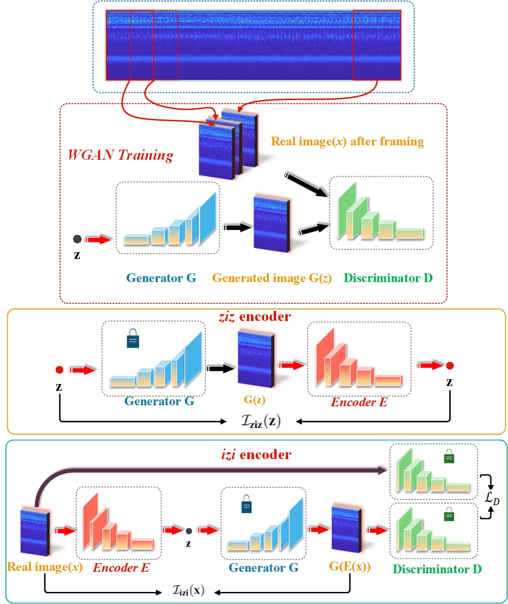

# AE-AnoWGAN

Most of the defects of rotating machinery are caused by faulty bearings, and bearing anomaly detection is of great significance to modern society. In the industrial field, the acquisition of fault samples is very time-consuming and expensive, and the labeling of fault samples also requires comprehensive domain knowledge. Based on this, an Auto-encoder Wasserstein Generative Adversarial Network(AE-AnoWGAN) method is proposed in this paper, which is an unsupervised learning method that can identify abnormal industrial signal time-frequency representation without the need of labels. AE-AnoWGAN used the improved WGAN with gradient penalty (WGAN-GP) for stable GAN training. Firstly, we builded generative models of training data using the continuous wavelet transform for time-frequency representation in the health industry domain, and proposed a technique for fast mapping of new data to the latent space of GANs. Then, we trained the encoder to map the time-frequency representation under test into the latent space, and evaluated the generated time-frequency representation for outliers to determine whether the time-frequency representation is abnormal. Thirdly, for the continuous operational industrial data, a pattern of continuous deterioration was followed, reaching a critical threshold of anomalies and thus identified as anomalies. For continuous degenerate failures, the proposed approach will get the increase in failure anomalies through the anomaly detection score. After reaching the critical value, it will be judged as abnormal. We compared the proposed method with alternative methods on the PU bearing dataset, and provided comprehensive empirical evidence that the AE-AnoWGAN method outperforms alternative methods with high anomaly detection accuracy and is able to positioning exceptions at the level.
`AEanoWgan/train_wgangp.py` and `AEanoWgan/train_encoder_izif.py` are modified eriklindernoren's `wgan_gp.py` for AE-AnoWGAN.  
`mvtec_ad/model.py` is modified eriklindernoren's `dcgan.py` for AE-AnoWGAN.

The framework of the paper is shown in the figure

## Requirements

Python 3.6 or later  
PyTorch 1.x

Matplotlib  
Numpy  
pandas  
Pillow  
scikit-learn

## Datasets
The Datasets of this project are all bearing data sets are processed by matlab time-frequency diagram, download address is as follows :

If you want to generate time-frequency diagrams yourself, you need to download each bearing data set yourself, and then use the matlab code in the project to convert them into time-frequency diagrams.

Place the corresponding data set under the corresponding directory, for example the CRWU data set needs to be placed under the directory:CRWU Dataset.

If you don't want to train to get the results in the paper, the download includes the 'results' directory, which you can use directly.

https://1drv.ms/u/s!AjzxxTzS2OujgQOD_77aXfwoPNnT?e=hfp7E1

## Results
After the later code runs, you will get the directory 'results'. If you want to directly get the results in the paper, you can directly download the results and run the 'plot.py' to get the experimental results.

https://1drv.ms/u/s!AjzxxTzS2OujgQOD_77aXfwoPNnT?e=hfp7E1

In the end, your file directory should be like this.


## Usage for training and test a dataset

### CRWU Dataset

Please run below in order on the GPU.

#### Step: 0

```
cd CRWU Dataset
```

#### Step: 1

```
python train_wgangp.py "dataset/training"
```

#### Step: 2

```
python train_encoder_izif.py "dataset/training"
```

#### Step: 3

```
python test_anomaly_detection.py "dataset/test"
```

After Step: 3, `score.csv` will be generated in the directory `results`.


#### Step: 4

```
python save_compared_images.py "dataset/test" --n_iters 100
```

Compared images are saved under `AE-AnoWGAN/CRWU Dataset/results/images_diff`.

#### Step: 5
```
python plot.py
```

#### Visualization


### IMS dataset

Please run below in order.

#### Step: 0

```
cd IMS Dataset
```

#### Step: 1

```
python train_wgangp.py "dataset/training"
```

#### Step: 2

```
python train_encoder_izif.py "dataset/training"
```

#### Step: 3

```
python test_anomaly_detection.py "dataset/test"
```

After Step: 3, `score.csv` will be generated in the directory `results`.

#### Step: 4

```
python save_compared_images.py "dataset/test" --n_iters 100
```

Compared images are saved under `AE-AnoWGAN/IMS Dataset/results/images_diff`.

#### Step: 5
```
python plot.py
```
#### Visualization


### PU dataset

Please run below in order.

#### Step: 0

```
cd PU Dataset
```

#### Step: 1

```
python train_wgangp.py "dataset/training"
```

#### Step: 2

```
python train_encoder_izif.py "dataset/training"
```

#### Step: 3

```
python test_anomaly_detection.py "dataset/test"
```

After Step: 3, `score.csv` will be generated in the directory `results`.

#### Step: 4

```
python save_compared_images.py "dataset/test" --n_iters 100
```

Compared images are saved under `AE-AnoWGAN/PU Dataset/results/images_diff`.

#### Step: 5
```
python plot.py
```
#### Visualization


The comparison of AE-AnoWGAN with other fault diagnosis methods is shown below :


If you want to replicate a comparison experiment, you need to use anomlib:
https://github.com/openvinotoolkit/anomalib